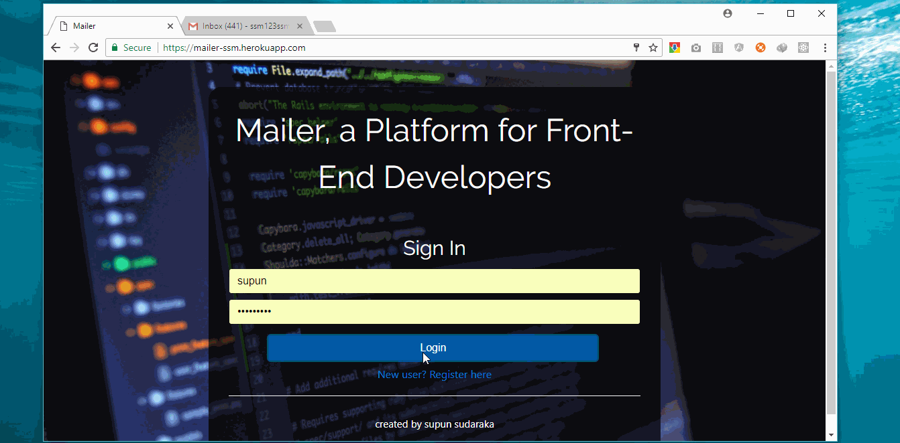

# Mailer is an open-source platform for form submissions.

[](https://gitter.im/mailer-ssm/Lobby?utm_source=badge&utm_medium=badge&utm_campaign=pr-badge&utm_content=badge)

A tool for getting form data on web pages as an email, without having to write a single line of server-side code.
2017 | By ssm123ssm




### [This is the app hosted on heroku](https://mailer-ssm.herokuapp.com)
#### [Android App release 1.0](./app-release.apk) 

### You don't even have to expose your email address in the form!

If you are a front-end web designer and you have forms in your website, 
you have to add back-end logic and admin panels to view the data submitted through that form.

Mailer makes things easier. 

On registration, and adding a project, it registers a unique URL for your form. All the post requests that would come
to that URL through forms will be processed and emailed to the developer.

### HOW TO USE

* Add a new project and give it a name. For example, if this is for your personal portfolio, name it as Portfolio... When someone submits a form in your portfolio, you will get an email with the project name in the heading. 
So you can identify from which form the data was recieved.

* Add a redirect URL if you want. This is the URL of the page that you need the user to be sent after the form submission. 
You can choose the default redirect, so that the user will be sent to a page generated by Mailer containing a 'success message'. User can press 'back' on browser to come back to the page with the form. 
If you want the user to stay in the same page after form submission, enter the URL of that page as the redirect URL.

* Once you successfully added the project, a link will be generated and displayed under My Projects. 
Insert that URL as the "action" attribute of the form tag and also add "method" attribute as "POST", and you are done! 

 
 ```html
 <form> action="example.link/mailer?id=00000001" method="POST" </form>
 ```
 

* Whenever a user submits your form, you will recieve an email with form data and the Project name in the head and subject.
You can remove your projects anytime you want and the URL generated for that project is permenently discarded. The same project link can not be regenerated for a new project.

### If you have any question, or have any suggestion to improve Mailer, contact me at ssm123ssm@gmail.com. 

### If you'd like to collaborate on this project, please contact me on above email address.
